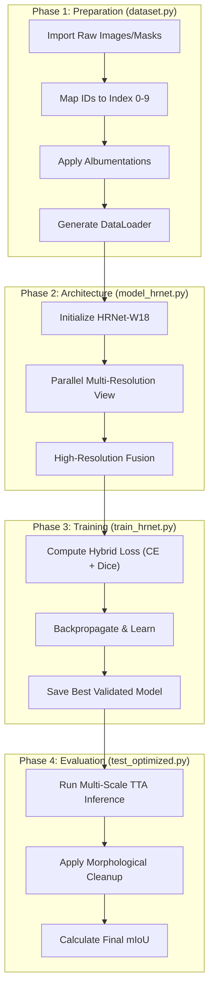

# Falcon-Segmentation: High-Resolution Off-Road Scene Parsing


## 🌵 Project Overview
This repository contains a state-of-the-art semantic segmentation pipeline specifically engineered for **Off-Road Desert Environments**. Navigating autonomous vehicles in desert terrains presents unique challenges: subtle texture differences between "Dry Bushes" and "Ground Clutter," varying lighting conditions, and the need for high-resolution spatial awareness to identify small obstacles like "Rocks" and "Logs."

Our solution leverages **HRNet (High-Resolution Network)**, which maintains high-resolution representations throughout the network, combined with a hybrid loss strategy and advanced inference techniques to achieve superior Mean IoU (mIoU).

---

---

## 🔄 System Flow: Process Overview
The following chart outlines the sequential process from raw data to final evaluation:



---

## 💡 How it Works (In Plain English)

Building a robot that can see in the desert is hard because everything is the same color (sand and rocks). Here is how we solved it, script by script:

### 1. The Organizer (`dataset.py`)
Imagine the computer sees colors as weird code numbers (like "7100" for sand). This file "translates" those codes into a simple list from 0 to 9. It also "toughens up" the data by making it blurry, dark, or flipped—so our AI doesn't get confused when it sees a real desert for the first time.

### 2. The Eyes and Brain (`model_hrnet.py`)
Normally, computers shrink images to look at them, which makes them lose detail. Our **HRNet** is different; it keeps the image's high resolution all the way through. It’s like having one eye that sees the big picture (the horizon) and another eye that sees tiny things (a small rock) at the same time.

### 3. The Teacher (`loss.py` & `train_hrnet.py`)
These files act like a strict teacher. When the AI makes a guess, the `loss.py` script measures exactly how far off it was. If it misses a "Rock" (which is dangerous!), it gets a bigger penalty. Over 30 "lessons" (epochs), the AI gets smarter and smarter.

### 4. The Double-Checker (`test_optimized.py`)
When it's time for the final test, we don't just ask the AI to look at the photo once. We ask it to look at it from different distances and even upside down. Then, we use special filters to clean up any "static" in the result, like using a vacuum to clean up messy pixels.

---

## 🏗️ Project Architecture & Components

### 1. Model: HRNetV2_Segmentation (`model_hrnet.py`)
At the core of this project is an optimized HRNet-W18 backbone. Unlike traditional encoders that downsample and then upsample, HRNet maintains high-resolution branches in parallel.
- **Multiscale Fusion**: We extract features from strides 4, 8, 16, and 32. All features are upsampled and concatenated to form a rich, 1920-channel representation that captures both fine-grained details (like rock edges) and global context (like the horizon).
- **Early Layer Freezing**: To facilitate stable fine-tuning on specialized datasets, the model includes logic to freeze the initial stem and Stage 1 layers.

### 2. Dataset Management (`dataset.py`)
Off-road datasets often use non-contiguous, high-integer class IDs. This module handles:
- **Class Remapping**: Automatically maps raw pixel values (100, 200, 300, etc.) to a standard 0-9 index range.
- **Robust Augmentation**: Uses `Albumentations` to apply:
    - `RandomResizedCrop`: Simulates the vehicle being at different distances from objects.
    - `GaussNoise` & `BrightnessContrast`: Simulates dust interference and harsh desert sunlight.
    - `Rotate` & `Flip`: Enhances spatial invariance.

### 3. Loss Strategy: `CombinedLoss` (`loss.py`)
Desert scenes suffer from heavy class imbalance (e.g., plenty of "Landscape" but few "Rocks").
- **Hybrid Loss**: Combines **Cross-Entropy (CE)** for pixel-wise classification accuracy and **Dice Loss** to optimize for region overlap and boundary precision.
- **Weighted Optimization**: Allows for class-specific penalties, ensuring the model doesn't ignore small, critical classes.

### 4. Training Engine (`train_hrnet.py`)
A production-ready training script featuring:
- **Automatic Mixed Precision (AMP)**: Speeds up training on NVIDIA GPUs by using float16 where possible.
- **Dynamic Weight Schedule**: Automatically adjusts class weights during training (e.g., at epoch 5) to shift focus from "hard class learning" to "global stability."
- **Cosine Annealing**: Smoothly decays the learning rate to find the global minimum.

### 5. Advanced Inference (`test_optimized.py`)
To maximize competition/deployment performance, we use **Test-Time Augmentation (TTA)**:
- **Multi-Scale Inference**: Runs the image at 0.75x, 1.0x, and 1.25x scales.
- **Morphological Post-Processing**: Uses OpenCV to perform "Closing" operations on specific classes (Dry Bushes/Ground Clutter), filling predicted holes and smoothing noise.

---

## 📊 Class Mapping Table

| ID (Raw) | Index | Class Name | Description |
| :--- | :--- | :--- | :--- |
| 100 | 0 | **Trees** | Rare vertical desert vegetation |
| 200 | 1 | **Lush Bushes** | Greener vegetation in oasis-like spots |
| 300 | 2 | **Dry Grass** | Low-lying yellowed vegetation |
| 500 | 3 | **Dry Bushes** | Brittle, brown desert shrubs |
| 550 | 4 | **Ground Clutter** | Small debris/pebbles on the surface |
| 600 | 5 | **Flowers** | Transitional feature class |
| 700 | 6 | **Logs** | Fallen wood/large obstacles |
| 800 | 7 | **Rocks** | Hard hazards, critical for navigation |
| 7100 | 8 | **Landscape** | General ground/dirt/sand |
| 10000 | 9 | **Sky** | Atmospheric region |

---

## 🚀 Getting Started

### 1. Installation
```bash
pip install -r requirements.txt
```

### 2. Training
Run the training script with your dataset path:
```bash
python train_hrnet.py --data_root "path/to/dataset" --epochs 30 --batch_size 10
```

### 3. Optimized Inference
Run the evaluation with Multi-scale and Post-processing enabled:
```bash
python test_optimized.py --model_path "best_hrnet_model.pth" --data_dir "path/to/val" --use_multiscale --use_postprocess
```

---

## 🛠️ File Structure
- `model_hrnet.py`: HRNetV2 architecture with multi-scale fusion.
- `dataset.py`: FalconDataset with class mapping and Albumentations.
- `loss.py`: Hybrid CE + Dice loss implementation.
- `train_hrnet.py`: Main training loop with AMP and dynamic scheduling.
- `test_optimized.py`: High-performance inference script with TTA.
- `utils.py`: Metric calculations and visualization helpers.
- `requirements.txt`: Project dependencies.

---

## 🌟 Acknowledgements
Created for the Falcon-Segmentation project to advance autonomous navigation in unmapped desert terrains.
