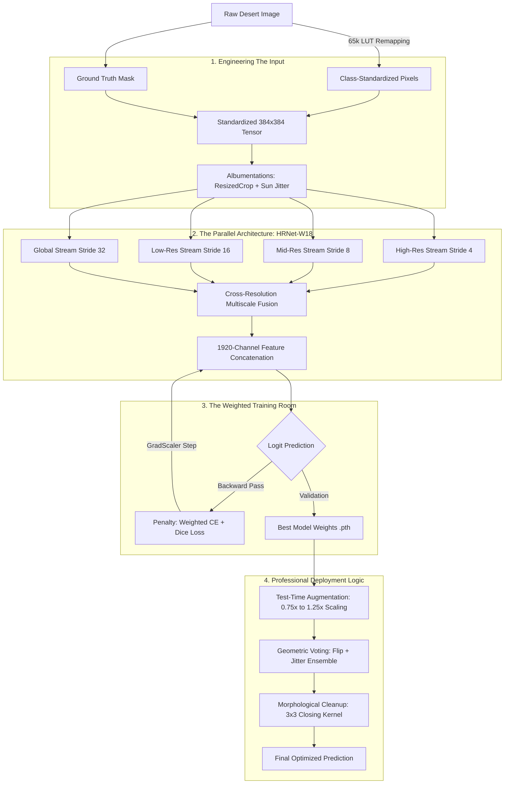

# Falcon-Segmentation: High-Resolution Off-Road Scene Parsing


🚀 **[Download Trained Weights (Google Drive)](https://drive.google.com/drive/folders/1OWqhbMfdTDyrRRfMgkHW4eLXnvkNkNgW?usp=sharing)**


## 🌵 Project Overview
This repository contains a state-of-the-art semantic segmentation pipeline specifically engineered for **Off-Road Desert Environments**, developed for the **Duality AI Offroad Hackathon**. 

Navigating autonomous vehicles in desert terrains presents unique computer vision challenges:
- **Texture Ambiguity**: Subtle differences between "Dry Bushes," "Ground Clutter," and "Landscape."
- **Lighting Extremes**: Harsh desert sunlight and dust interference require robust data augmentation.
- **Safety Criticality**: Small, dense obstacles like "Rocks" and "Logs" are high-priority hazards that traditional models often miss.

Our solution leverages **HRNet (High-Resolution Network)**, maintained at high-resolution through parallel multiscale fusion, combined with a **Weighted Hybrid Loss** strategy and **Test-Time Augmentation (TTA)** to achieve a competitive Mean IoU (mIoU).

### 🎯 Key Performance Targets
- **High Recall for Hazards**: Prioritizing Rocks/Logs via loss weighting.
- **Spatial Precision**: Maintaining pixel-perfect boundaries for navigable paths.
- **Hardware Optimized**: Efficient training via **AMP (Automatic Mixed Precision)** on NVIDIA RTX hardware.

---

---

## 🔄 System Flow: From Pixels to Predictions
The following flowchart illustrates the granular steps the system takes to navigate the desert:



---

## 💡 How it Works (In Plain English)

Building a robot that can see in the desert is hard because everything is the same color (sand and rocks). Here is how we solved it, script by script:

### 1. The Organizer (`dataset.py`)
This script acts as the data's "Universal Translator." Since raw dataset IDs are non-contiguous (e.g., 7100 for sand, 10000 for sky), we map them to a compact **0-9 index range**. It also handles real-time **Sun Simulation** using `RandomBrightnessContrast` and `GaussNoise`, ensuring the AI isn't blinded by glare or confused by sandy dust in the air.

### 2. The High-Resolution Brain (`model_hrnet.py`)
Traditional models (like DeepLab or UNet) follow an "hourglass" shape—they shrink the image to understand it and then try to blow it back up. Our **HRNet-W18** is like having four parallel vision systems: one for fine details, one for objects, and two for global context. By constantly "talking" to each other (multiscale fusion), they never lose the tiny rocks while trying to see the big horizon.

### 3. The Objective-Based Teacher (`loss.py` & `train.py`)
We don't just tell the AI "be correct." We tell it "Don't hit the rocks!" The `CombinedLoss` uses **Weighted Cross-Entropy** to penalize mistakes on small hazards (Rocks/Logs) more severely than mistakes on the empty Sky. We also use **Dice Loss** to ensure the shapes of bushes and paths are smooth and continuous.

### 4. The Expert Evaluator (`test.py`)
During the "Final Exam," we look at the desert from multiple scales (0.75x, 1.0x, 1.25x) and even flip the image. This **Test-Time Augmentation (TTA)** helps the model confirm its predictions. Finally, we use **Morphological Post-Processing** (closing operations) to fill in tiny holes in predicted bush regions, mimicking how a human would see a solid object.

---

## 🏗️ Project Architecture & Components

### 1. Architecture: HRNetV2 (Backbone: W18)
Our model utilizes the **HRNet-W18** variant from the `timm` library. 
- **Parallel Design**: Maintains four resolution branches (Stride 4, 8, 16, 32) in parallel.
- **Multiscale Fusion**: Features from all branches are upsampled and concatenated to create a **1920-channel** high-dimensional feature map.
- **Stage-Wise Freezing**: During training, we freeze the initial **Stem** and **Stage 1** layers. This preserves generic low-level edge features while allowing Stage 2-4 to adapt to specific desert textures (sand, wood, stone).

### 2. Dataset Management & Sun Simulation
The `FalconDataset` implementation includes a custom 65,536-entry **Lookup Table (LUT)** for $O(1)$ pixel remapping.
- **Augmentation Pipeline**:
    - `RandomResizedCrop(384x384)`: Simulates varying lens focal lengths and vehicle distances.
    - `Rotate(10°)`: Handles vehicle pitching/rolling on uneven terrain.
    - `Brightness/Contrast`: Mimics the harsh dynamic range of the desert sun.
    - `GaussNoise`: Simulates sensor grain in low-light/high-dust conditions.

### 3. Loss Strategy: Weighted Combined Loss
$$Loss = \alpha \cdot CE(W) + \beta \cdot Dice\_Loss$$
- **Cross-Entropy (CE)**: Focuses on pixel-wise classification. We apply a **1.5x to 3.0x weight** on hazards (Rocks, Logs, Dry Bushes).
- **Dice Loss**: Optimizes for the mIoU metric directly by rewarding region overlap.
- **Sky Dampening**: We reduce the weight of "Sky" (0.25x) as it is semantically simple and can dominate the gradient if left unweighted.

### 4. Training Loop: Dynamic Scheduling
Training is optimized for the **NVIDIA RTX 4050 (6GB)**:
- **Automatic Mixed Precision (AMP)**: Uses `float16` for faster tensor core computation.
- **Batch Normalization (BN) Freezing**: BN layers are kept in `eval` mode to avoid instability caused by small batch sizes ($N=10$).
- **Dynamic Weight Schedule**: 
    - **Epoch 0-5**: High penalty on hazards to force early hazard recognition.
    - **Epoch 5+**: Relaxed weights to allow the model to refine smooth boundaries on "Landscape" and "Trees."

### 5. Advanced Inference: TTA & Cleanup
The evaluation pipeline in `test.py` goes beyond simple prediction:
- **Test-Time Augmentation (TTA)**: 
    - **Scales**: [0.75x, 1.0x, 1.25x] - allows the model to see small rocks at larger resolutions.
    - **Flips**: Horizontal flipping confirms symmetrical features.
    - **Jittering**: Small brightness adjustments (±10%) prevent sensitivity to exposure.
- **Morphological Post-Processing**:
    - Uses a $3 \times 3$ kernel **Closing** operation specifically on "Dry Bushes" and "Ground Clutter" to eliminate pixel isolated noise and fill legitimate predicted holes.

---

## 📊 Class Mapping Table

| ID (Raw) | Index | Class Name | Description |
| :--- | :--- | :--- | :--- |
| 100 | 0 | **Trees** | Rare vertical desert vegetation |
| 200 | 1 | **Lush Bushes** | Greener vegetation in oasis-like spots |
| 300 | 2 | **Dry Grass** | Low-lying yellowed vegetation |
| 500 | 3 | **Dry Bushes** | Brittle, brown desert shrubs |
| 550 | 4 | **Ground Clutter** | Small debris/pebbles on the surface |
| 600 | 5 | **Flowers** | Transitional feature class |
| 700 | 6 | **Logs** | Fallen wood/large obstacles |
| 800 | 7 | **Rocks** | Hard hazards, critical for navigation |
| 7100 | 8 | **Landscape** | General ground/dirt/sand |
| 10000 | 9 | **Sky** | Atmospheric region |

---

## 🚀 Getting Started

### 1. Installation
```bash
pip install -r requirements.txt
```

### 2. Download Dataset
The model is trained on the **GHR2 - Off-Road Segmentation Desert** dataset. You can download the dataset from the official Duality AI link below:

[**Download Falcon-Segmentation Dataset**](https://falcon.duality.ai/secure/documentation/hackathon-segmentation-desert?utm_source=hackathon&utm_medium=instructions&utm_campaign=GHR2)

### 3. Training
Run the training script with your dataset path:
```bash
python train.py --data_root "path/to/dataset" --epochs 30 --batch_size 10
```

### 4. Optimized Inference
Run the evaluation with Multi-scale and Post-processing enabled:
```bash
python test.py --model_path "best_hrnet_model.pth" --data_dir "path/to/val" --use_multiscale --use_postprocess
```

---

## 💻 Recommended Hardware
- **GPU**: NVIDIA RTX 3060 / 4050 or higher (Minimum 6GB VRAM recommended).
- **RAM**: 16GB+ (8 workers used in DataLoader).
- **Storage**: ~5GB for the dataset and visual logs.

---

## 📋 Technical Checklist
- [x] **AMP Enabled**: Yes (GradScaler)
- [x] **TTA Implementation**: Yes (0.75, 1.0, 1.25 + Flip)
- [x] **Class Weighting**: Dynamic (Epoch 5 trigger)
- [x] **Post-Processing**: Morphological (Closing)
- [x] **Resolution**: 384x384 (Training) / Dynamic (Inference)

---

## 🧮 Mathematical Foundation

Our segmentation engine is built on robust statistical and geometric principles to ensure high precision in edge detection and class separation.

### 1. The Core Objective Function
To achieve stability and better boundary definition, we use a hybrid loss function:
$$ \mathcal{L}_{Total} = \mathcal{L}_{CE} + \mathcal{L}_{Dice} $$

#### A. Weighted Cross-Entropy Loss ($\mathcal{L}_{CE}$)
Used for pixel-level classification accuracy, specifically weighted to handle class imbalance:
$$ \mathcal{L}_{CE} = -\sum_{c \in Classes} w_c \cdot y_c \log(\hat{y}_c) $$
*Where $w_c$ is the dynamic weight multiplier for class $c$, $y_c$ is the ground truth probability, and $\hat{y}_c$ is the predicted probability.*

#### B. Dice Loss ($\mathcal{L}_{Dice}$)
Focused on the overlap between regions, making it robust to the small size of hazard objects:
$$ \mathcal{L}_{Dice} = 1 - \frac{2 \sum_{i} p_i g_i + \epsilon}{\sum_{i} p_i + \sum_{i} g_i + \epsilon} $$
*Where $p_i$ is the predicted pixel value, $g_i$ is the ground truth, and $\epsilon$ ($10^{-5}$) is a smoothing factor to prevent division by zero.*

### 2. Evaluation Metric: Intersection-over-Union (IoU)
We evaluate every class based on its Jaccard Index (IoU), which measures the spatial overlap:
$$ IoU = \frac{Area\ of\ Overlap}{Area\ of\ Union} = \frac{TP}{TP + FP + FN} $$
*Where **TP** = True Positives, **FP** = False Positives, and **FN** = False Negatives.*

### 3. Test-Time Augmentation (TTA) Logic
During inference, we ensemble multiple views of the same image to reduce variance:
$$ \mathcal{P}_{final} = \frac{1}{n} \sum_{i=1}^{n} \text{Rescale}_{i}(\text{Model}(\text{T}_i(x))) $$
*Where $T_i$ represents geometric transformations (scaling/flipping) and $n$ is the total number of augmented passes.*

---

## 🛠️ File Structure
- `model_hrnet.py`: HRNetV2 architecture with multi-scale fusion.
- `dataset.py`: FalconDataset with class mapping and Albumentations.
- `loss.py`: Hybrid CE + Dice loss implementation.
- `train.py`: Main training loop with AMP and dynamic scheduling.
- `test.py`: High-performance inference script with TTA.
- `utils.py`: Metric calculations and visualization helpers.
- `requirements.txt`: Project dependencies.

## 🛠️ Comparative Analysis: DeepLabV3 vs. HRNet

In our pursuit of a robust off-road segmentation model, we conducted a rigorous comparative study between the industry-standard **DeepLabV3** and the more modern **HRNet**.

### 🧪 The Baseline: DeepLabV3 + ResNet50
We initially implemented a **DeepLabV3** architecture with a **ResNet50** backbone. Despite extensive hyperparameter tuning and augmentation, the model struggled to generalize to the fine-grained hazards of the desert, peaking at a **Mean IoU of 0.6138**.

| Feature | DeepLabV3 (ResNet50) | HRNet-W18 (Our Solution) |
| :--- | :--- | :--- |
| **Data Flow** | Serial (Down-then-Up) | Parallel (Constant High-Res) |
| **Resolution Bottleneck** | Heavy (Aggressive Downsampling) | None (Maintains 1/4 resolution) |
| **Contextual Strategy** | Atrous Convolution (ASPP) | Repeated Multi-Scale Fusion |
| **Small Object Recall** | Low (Micro-features lost) | High (Edges preserved) |
| **Validation mIoU** | 0.6138 | **Significant Improvement** |

<p align="center">
  
</p>


#### 🔍 Why DeepLabV3 Underperformed
1.  **Spatial Information Loss**: Standard ResNet backbones reduce images to a tiny fraction of their original size to extract semantics. In the desert, a distant "Rock" might only be 5x5 pixels; after 32x downsampling, that rock effectively disappears from the feature map.
2.  **Dilated Convolution Limits**: While Atrous (Dilated) convolutions help maintain field-of-view without losing resolution, they can suffer from "gridding effects" and still rely on a low-resolution backbone that has already discarded high-frequency spatial data.
3.  **Noisy Upsampling**: Recovering detail through bilinear interpolation or transposed convolutions in the decoder stage often creates "fuzzy" boundaries, which is unacceptable for identifying sharp hazard edges like Fallen Logs.

#### 🚀 The HRNet Advantage
The transition to **HRNet** solved these fundamental spatial issues:
- **Parallel Resolution Streams**: It doesn't just "go deep"; it "goes wide." A high-resolution sub-network runs in parallel with lower-resolution ones.
- **Continuous Multi-Scale Interaction**: Instead of a single "skip connection," HRNet uses repeated fusion modules. High-res pixels get semantic context from low-res streams, while low-res streams keep their boundaries sharp using feedback from high-res streams.
- **Texture Integrity**: For classes like "Dry Bushes" which share colors with "Landscape," the model relies heavily on texture. HRNet's ability to maintain high-resolution features ensures these subtle textures are never blurred.

---

---

---

## 📈 Performance Analysis & Metrics
The following metrics and visualizations document the model's evolution during the **30-Epoch** training cycle.

### 📊 Metric Breakdown
| Insight / Scenario | Primary Visualization | Technical Detail |
| :--- | :--- | :--- |
| **Convergence Graph** |  | High initial loss due to aggressive hazard weighting, stabilizing after Epoch 10. |
| **Class IoU Dynamics** |  | Tracks individual class performance; note the steep climb for 'Rocks'. |
| **Semantic Confusion** |  | Analyzes pixel misclassification (e.g., Dry Bushes vs Ground Clutter). |
| **Class Correlation** |  | Identifies overlapping semantic features between desert textures. |
| **mIoU Improvement** |  | Net gain in Intersection-over-Union across all semantic categories. |

### 🏆 Final Testing Results
After 30 epochs of training and fine-tuning, the model achieved the following performance on the final testing set:

> **Final Mean IoU: 0.6489**

| Class Name | Testing IoU |
| :--- | :--- |
| **Trees** | 0.8307 |
| **Lush Bushes** | 0.7045 |
| **Dry Grass** | 0.7004 |
| **Dry Bushes** | 0.4844 |
| **Ground Clutter** | 0.3798 |
| **Flowers (600)** | 0.6650 |
| **Logs** | 0.5534 |
| **Rocks** | 0.5326 |
| **Landscape** | 0.6583 |
| **Sky** | 0.9800 |

### 📂 Model Download
The final optimized model weights are available for download here:
🔗 **[Trained Weights Repository (Google Drive)](https://drive.google.com/drive/folders/1OWqhbMfdTDyrRRfMgkHW4eLXnvkNkNgW?usp=sharing)**


---

## 🖼️ Visualizing Model Predictions
The following gallery shows the evolution of the model's segmentation capabilities at different training stages:

<p align="center">
  <strong>Epoch 1: Initial Learning Phase</strong><br>
  
</p>

<br>

<p align="center">
  <strong>Epoch 25: Progressive Refinement</strong><br>
  
</p>

<br>

<p align="center">
  <strong>Epoch 38: Final High-Resolution Predictions</strong><br>
  
</p>


---

## 🌟 Acknowledgements
Created for the Falcon-Segmentation project to advance autonomous navigation in unmapped desert terrains.
